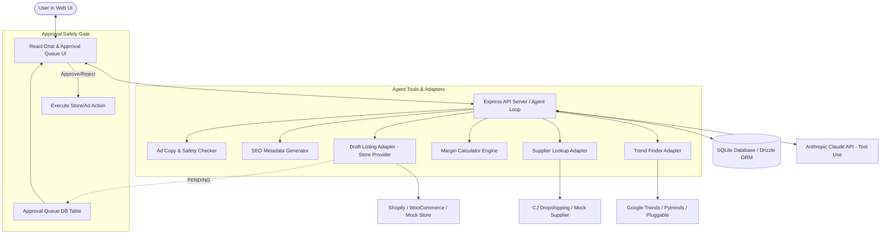

# Dropshipping AI Assistant - Architecture & Implementation Plan

This document presents the Phase 0 architecture proposal, database schema, project structure, external services/API key requirements, and multi-phase roadmap for building the Dropshipping AI Assistant.

> [!IMPORTANT]
> **Phase 0 Requirement**: Review the proposed architecture, database schema, and project structure below. Work will only proceed to Phase 1 upon your explicit approval.

---

## 1. User Review Required & Design Choices

1. **Tech Stack Recommendation**:
   - **Backend**: **Node.js + TypeScript (Express)** with the official `@anthropic-ai/sdk` and `better-sqlite3` (or `drizzle-orm` for easy Postgres migration). *Note*: Python `pytrends` can be called via a lightweight Python CLI bridge script or native Google Trends HTTP API / wrapper.
   - **Frontend**: **React + Vite + TypeScript** styled with modern Vanilla CSS / Tailwind (dark mode, glassmorphism, responsive sidebar, approval queue cards, interactive chat, live tool logs).
   - **LLM Engine**: Anthropic Claude API using native **Tool Use (Function Calling)** with configurable model via `ANTHROPIC_MODEL` env var (e.g. `claude-3-5-sonnet-20241022` or `claude-3-7-sonnet-20250219`).

2. **Pluggable Architecture**:
   - **Store Adapter**: Interface `IStoreAdapter` supporting `ShopifyAdapter`, `WooCommerceAdapter`, and `MockStoreAdapter`.
   - **Supplier Adapter**: Interface `ISupplierAdapter` supporting `CJDropshippingAdapter`, `AliExpressDSersAdapter`, `SpocketAdapter`, and `MockSupplierAdapter`.
   - **Trend Adapter**: Interface `ITrendAdapter` supporting `GoogleTrendsAdapter`, `TikTokCreativeCenterAdapter` (pluggable mock/stub), `MetaAdLibraryAdapter` (pluggable stub), and `AmazonBestSellersAdapter` (pluggable stub).

3. **Safety & Approval Queue System**:
   - Any write action (`create_draft_listing`, publishing, ad creation/spending) is flagged as **`PENDING_APPROVAL`**.
   - Executing tools never directly trigger external store mutations or ad campaigns unless user approves in the Approval Queue sidebar.
   - Safety checks run automatically on copy generation: Trademark detection, Health claim detection, Income claim detection.

---

## 2. Open Questions & User Preferences

> [!NOTE]
> Please confirm or customize your preferences when approving:

- **Store Preference**: Do you prefer starting test mode with **Mock Store Data** or connecting directly to a **Shopify Development Store** / **WooCommerce Sandbox**?
- **Backend Stack Choice**: Node.js + TypeScript (Express) [Recommended] vs Python (FastAPI).
- **Default Niche & Target Country**: (Defaulting to Pet Supplies / Australia / AUD in mock configuration if not specified).

---

## 3. Architecture & System Flow



---

## 4. Database Schema (SQLite / Postgres Compatible)

```sql
-- Conversations & Messages
CREATE TABLE conversations (
    id TEXT PRIMARY KEY,
    title TEXT NOT NULL,
    created_at DATETIME DEFAULT CURRENT_TIMESTAMP,
    updated_at DATETIME DEFAULT CURRENT_TIMESTAMP
);

CREATE TABLE messages (
    id TEXT PRIMARY KEY,
    conversation_id TEXT NOT NULL REFERENCES conversations(id) ON DELETE CASCADE,
    role TEXT CHECK(role IN ('user', 'assistant', 'system', 'tool')) NOT NULL,
    content TEXT NOT NULL,
    tool_calls TEXT, -- JSON string of tool calls
    tool_results TEXT, -- JSON string of tool execution results
    created_at DATETIME DEFAULT CURRENT_TIMESTAMP
);

-- Products & Trends
CREATE TABLE trend_reports (
    id TEXT PRIMARY KEY,
    niche TEXT NOT NULL,
    country TEXT NOT NULL,
    keyword TEXT NOT NULL,
    demand_score INTEGER NOT NULL, -- 0-100
    growth_rate REAL NOT NULL, -- percentage
    competition_level TEXT CHECK(competition_level IN ('LOW', 'MEDIUM', 'HIGH')) NOT NULL,
    evidence_data TEXT NOT NULL, -- JSON formatted data source & metrics
    created_at DATETIME DEFAULT CURRENT_TIMESTAMP
);

CREATE TABLE products (
    id TEXT PRIMARY KEY,
    title TEXT NOT NULL,
    niche TEXT NOT NULL,
    supplier_name TEXT NOT NULL,
    supplier_url TEXT,
    supplier_price_aud REAL NOT NULL,
    shipping_cost_aud REAL NOT NULL,
    recommended_retail_price_aud REAL NOT NULL,
    estimated_ad_cost_aud REAL NOT NULL,
    platform_fee_aud REAL NOT NULL,
    net_margin_aud REAL NOT NULL,
    margin_percentage REAL NOT NULL,
    status TEXT CHECK(status IN ('DISCOVERED', 'MARGIN_CALCULATED', 'DRAFT_CREATED', 'PUBLISHED')) DEFAULT 'DISCOVERED',
    created_at DATETIME DEFAULT CURRENT_TIMESTAMP
);

-- Draft Listings & SEO
CREATE TABLE draft_listings (
    id TEXT PRIMARY KEY,
    product_id TEXT REFERENCES products(id),
    store_platform TEXT NOT NULL, -- 'shopify', 'woocommerce', 'mock'
    external_draft_id TEXT, -- ID returned from Store API if created
    meta_title TEXT NOT NULL,
    meta_description TEXT NOT NULL,
    slug TEXT NOT NULL,
    alt_text TEXT NOT NULL,
    tags TEXT NOT NULL, -- JSON array
    json_ld_schema TEXT NOT NULL, -- JSON string
    created_at DATETIME DEFAULT CURRENT_TIMESTAMP
);

-- Approval Queue (Safety Rule Enforcement)
CREATE TABLE approvals (
    id TEXT PRIMARY KEY,
    action_type TEXT CHECK(action_type IN ('CREATE_STORE_DRAFT', 'PUBLISH_LISTING', 'CREATE_AD_CAMPAIGN')) NOT NULL,
    payload TEXT NOT NULL, -- JSON details of requested action
    status TEXT CHECK(status IN ('PENDING', 'APPROVED', 'REJECTED')) DEFAULT 'PENDING',
    rejection_reason TEXT,
    created_at DATETIME DEFAULT CURRENT_TIMESTAMP,
    resolved_at DATETIME
);

-- Tool Audit Logs
CREATE TABLE tool_logs (
    id TEXT PRIMARY KEY,
    conversation_id TEXT,
    tool_name TEXT NOT NULL,
    arguments TEXT NOT NULL, -- JSON
    result TEXT NOT NULL, -- JSON
    status TEXT CHECK(status IN ('SUCCESS', 'FAILED')) NOT NULL,
    execution_time_ms INTEGER NOT NULL,
    created_at DATETIME DEFAULT CURRENT_TIMESTAMP
);
```

---

## 5. Folder & Directory Structure

```
Friday-ai/
├── README.md
├── .env.example
├── .gitignore
├── package.json
├── tsconfig.json
├── vite.config.ts
├── index.html
├── src/                         # Frontend (React + Vite + TypeScript)
│   ├── main.tsx
│   ├── App.tsx
│   ├── index.css               # Design system, glassmorphism, modern tokens
│   ├── components/
│   │   ├── Sidebar.tsx         # Navigation & active status
│   │   ├── Chat/
│   │   │   ├── ChatWindow.tsx  # Message stream & input box
│   │   │   ├── MessageItem.tsx # Markdown, tool call renders, code blocks
│   │   │   └── ToolCallCard.tsx# Live visual audit of executed tools
│   │   ├── ApprovalQueue/
│   │   │   ├── ApprovalList.tsx# Sidebar queue of pending actions
│   │   │   └── ApprovalCard.tsx# Interactive Approve/Reject modal/card
│   │   └── Dashboards/
│   │       ├── TrendReportCard.tsx
│   │       ├── MarginCalculatorModal.tsx
│   │       └── SEOPreviewModal.tsx
│   ├── services/               # API clients for backend communication
│   │   └── api.ts
│   └── types/                  # Shared TypeScript interfaces
│       └── index.ts
└── server/                      # Backend (Express + TypeScript)
    ├── index.ts                 # Server entry point
    ├── config.ts                # Env validation & defaults
    ├── db/
    │   ├── schema.ts            # Database initialization & migrations
    │   └── client.ts            # SQLite connection wrapper
    ├── agent/
    │   ├── agentLoop.ts         # Anthropic Tool Use loop & prompt orchestration
    │   ├── prompts.ts           # System prompt, safety rules, formatting rules
    │   └── tools/               # Agent tool implementations
    │       ├── findTrendingProducts.ts
    │       ├── lookupSupplierProduct.ts
    │       ├── calculateMargin.ts
    │       ├── createDraftListing.ts
    │       ├── generateSeoMetadata.ts
    │       ├── generateAdCopy.ts
    │       └── getStorePerformance.ts
    ├── adapters/                # Third-party service integrations
    │   ├── trends/
    │   │   ├── ITrendAdapter.ts
    │   │   ├── GoogleTrendsAdapter.ts
    │   │   └── MockTrendAdapter.ts
    │   ├── supplier/
    │   │   ├── ISupplierAdapter.ts
    │   │   ├── CJDropshippingAdapter.ts
    │   │   └── MockSupplierAdapter.ts
    │   └── store/
    │       ├── IStoreAdapter.ts
    │       ├── ShopifyAdapter.ts
    │       ├── WooCommerceAdapter.ts
    │       └── MockStoreAdapter.ts
    ├── safety/
    │   └── contentAuditor.ts    # Trademark, health claims, income claims checker
    ├── routes/
    │   ├── chat.ts
    │   ├── approvals.ts
    │   ├── products.ts
    │   └── trends.ts
    └── tests/                   # Unit & Integration tests
        ├── marginCalculator.test.ts
        ├── seoGenerator.test.ts
        └── safetyAuditor.test.ts
```

---

## 6. Required External Accounts & API Keys

To run the full suite in production (outside of Mock/Sandbox mode), the following credentials will be used in `.env`:

| Service / API | Purpose | Required in Mock Mode? | Env Variable |
| :--- | :--- | :--- | :--- |
| **Anthropic Claude** | LLM Engine for Agent Chat & Tool Calling | **YES** | `ANTHROPIC_API_KEY`, `ANTHROPIC_MODEL` |
| **Shopify Admin API** | Creating draft products, fetching store performance | NO (Mocked) | `SHOPIFY_STORE_URL`, `SHOPIFY_ADMIN_ACCESS_TOKEN` |
| **WooCommerce REST API** | Alternative store platform integration | NO (Mocked) | `WOOCOMMERCE_URL`, `WOOCOMMERCE_CONSUMER_KEY`, `WOOCOMMERCE_CONSUMER_SECRET` |
| **CJ Dropshipping API** | Sourcing product costs, shipping rates & inventory | NO (Mocked) | `CJ_DROPSHIPPING_EMAIL`, `CJ_DROPSHIPPING_API_KEY` |
| **Google Trends** | Niche product trend search | NO (Mocked) | Uses `pytrends` / SerpApi (`SERPAPI_KEY` optional) |
| **Meta / TikTok Ads** | Ad campaign creation & audience insights | NO (Mocked) | `META_ACCESS_TOKEN`, `TIKTOK_ACCESS_TOKEN` |

---

## 7. Phased Development Roadmap

- **Phase 0 (Current)**: Architecture proposal, database schema, folder structure, API key list. **[Awaiting User Approval]**
- **Phase 1**: Project setup + Express + SQLite DB + Anthropic Agent Chat loop + Approval Queue UI.
- **Phase 2**: Sourcing Tools (`find_trending_products`, `lookup_supplier_product`, `calculate_margin`) with data evidence & mock adapters.
- **Phase 3**: Store Listing Tools (`create_draft_listing`, `generate_seo_metadata`) + Approval Queue integration for drafts.
- **Phase 4**: Ad Copy Generator (`generate_ad_copy`) + Safety checkers (Trademark, Health/Income claims) + Mock Ad Platform API integration.
- **Phase 5**: Unit testing (Margin calculator & SEO validation), README, API rate limits doc, and final verification.

---

## Verification Plan

### Manual Verification
- Review this document `implementation_plan.md` to ensure all requirements, schemas, safety rules, and architecture choices align with expectations.
- Once approved, proceed to Phase 1.
